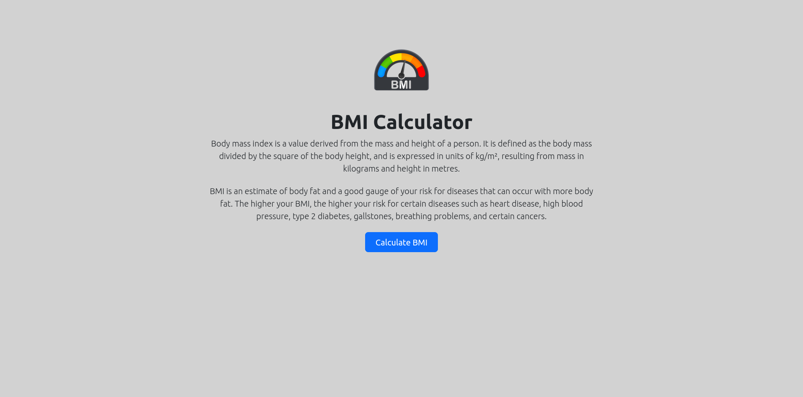
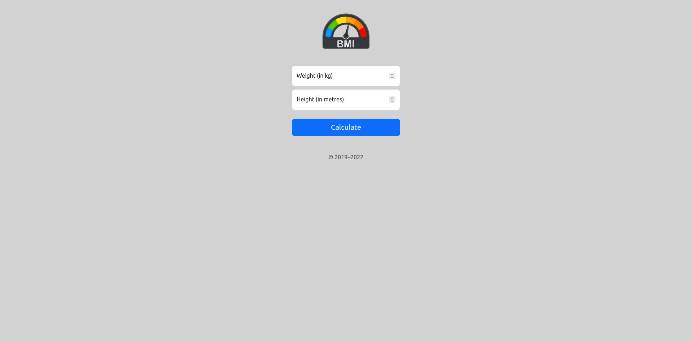

# BMI-calculator-with-express.js

- Basic BMI calculator.
- with express.js.
- bootstrap as frontend-toolkit.

## Screenshot

### Homepage



### Calculator



## Run app on your local machine:

Clone the repository

```
git clone https://github.com/Rohit-Saini7/BMI-calculator-with-express.js.git
```

Open the project in your favorite editor

```
cd BMI-calculator-with-express.js/
```

Install the dependencies

```
npm i
```

Run the project in your local machine

```
node index.js
```
